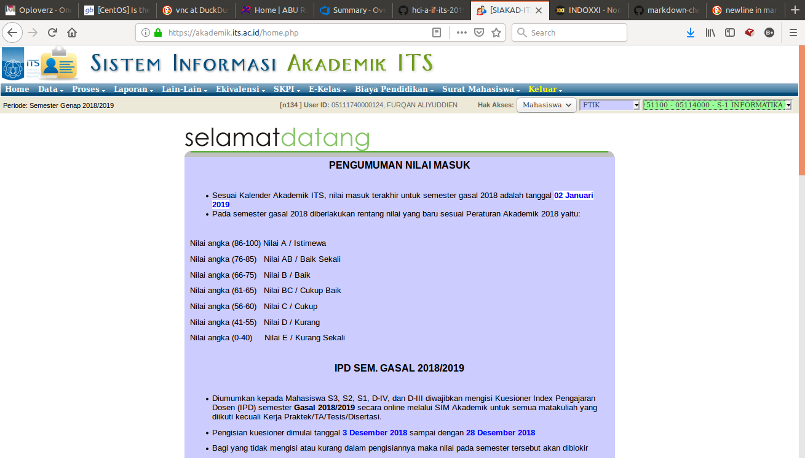
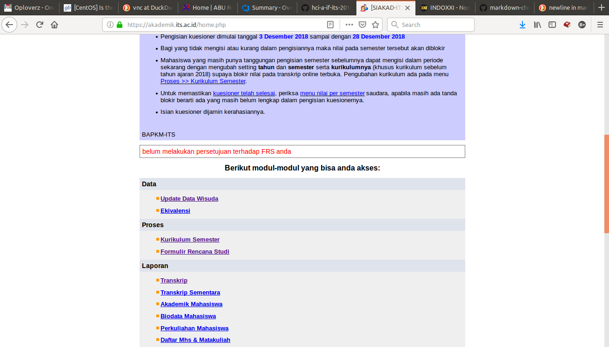
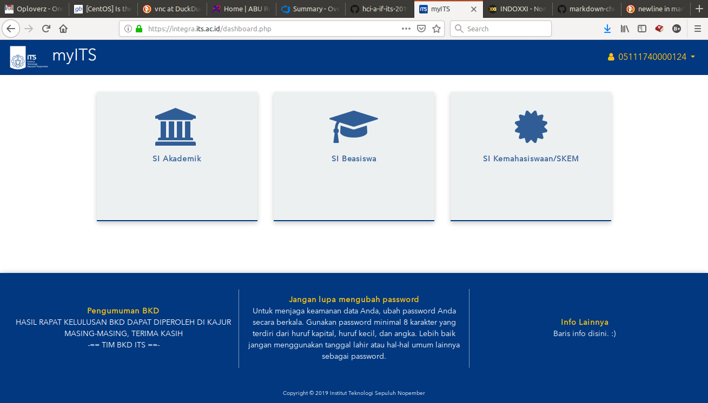
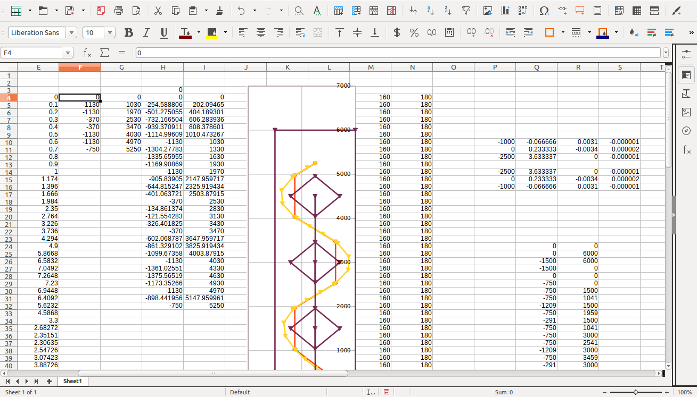
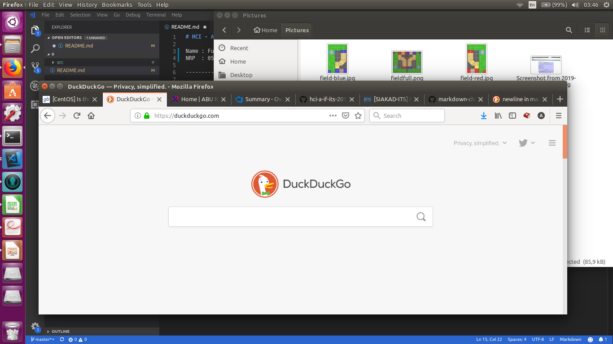

# HCI - Assignment 0 : Bad UI

Name : Furqan Aliyuddien   
NRP  : 05111740000124   

------------------------------------

# __Contents__
[1. SIAKAD ITS](#1SIAKAD-ITS)  
[2. LibreOffice](#2Libre-Office)  
[3. Linux Window](#3Linux-Window)  

- - - -  

1.SIAKAD ITS
------------------------------------------------

In the navigation bar of ITS's Academic Information System, there are feature of choosing Access Privilage, and dropdown menu to choose Faculty and Departement. Those features is clearly ***useless***, because we as a student can only have one faculty and departement at a time. I don't know whether lecturers can assigned in multiple faculty and departement or not, but atleast it is better if those feature is disabled or hidden in student access privilage mode.

That "***belum melakukan persetujuan terhadap FRS anda***" warning is always there regardless the FRS is already accepted or not.

That "___Info Lainnya___" is somewhat annoying.

- - - -  

2.Libre Office
----------------------------------------------

The toolbar for each product of Libre Office is nearly equal as which is shown in the picture above. There is no clear grouping or labelling text to describe those many buttons. I think it is easier to use if the tools is organized more clearly using label, group, or put in several tabs as in M*crosoft Office.

- - - -  

3.Ubuntu Window
-------------------------

As it shown in the picture above, the default menu bar of Ubuntu (16.04 LTS) operating system window located in top bar, even if the window is not maximized. This could be a problem for new users of the operating system. As it mentioned before, the OS which I found out having this issue is the 16.04 LTS version, I don't know for sure if this is different in the latest 18.04 version. But because for some reason I must stay at 16.04 version, I think there is need for fix to this problem.